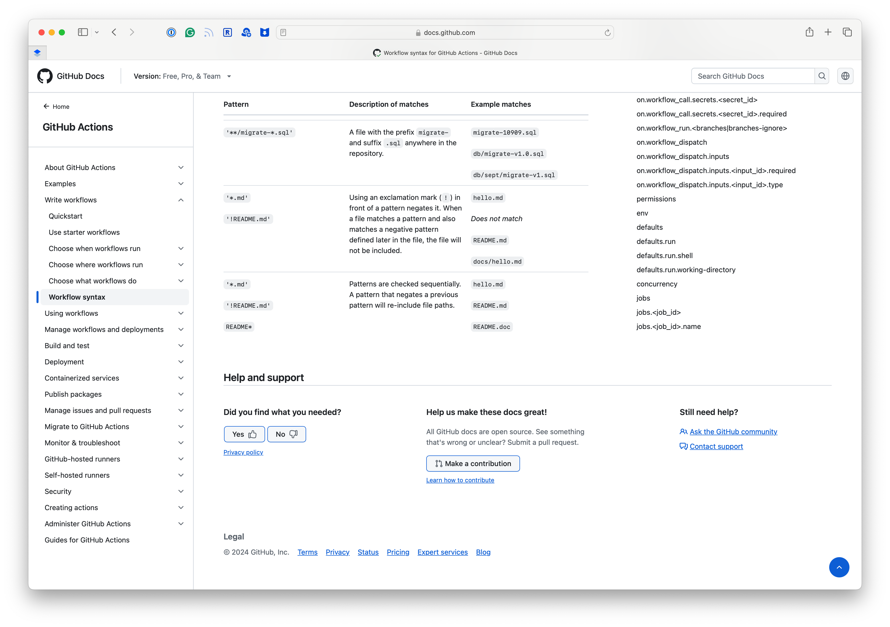
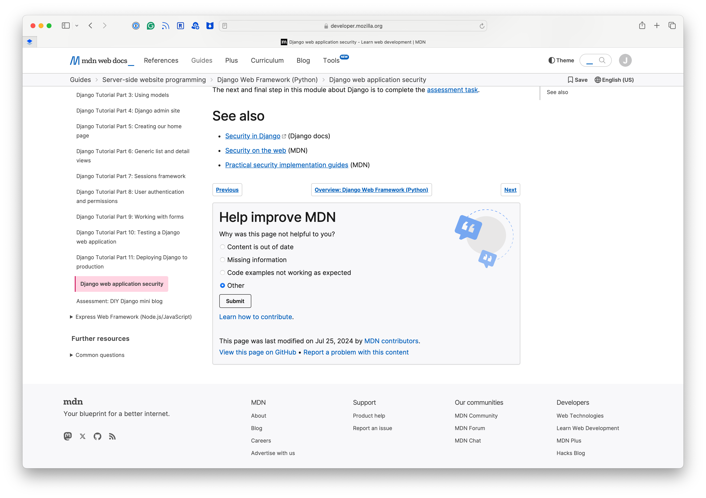

##########################################################
System for collecting user feedback in Rubin documentation
##########################################################

.. abstract::

   A straightforward way to determine the effectiveness of documentation, and determine ways to improve that documentation, is to let our users tell us. This technote describes the architecture for a system for collecting feedback such as ratings and comments from Sphinx/Documenteer documentation sites published on ``lsst.io`` and storing that feedback for subsequent querying in Sasquatch/InfluxDB. Ook, the documentation librarian service, serves as an intermediary for safely receiving feedback submissions.

Existing feedback implementations
=================================

Most large documentation sites, particularly in the tech and open source sector, provide some mechanism for users to provide feedback on the documentation.

Feedback data models
--------------------

Documentation feedback widgets are generally presented to the user as a simple thumbs up/thumbs down rating (GitHub, :numref:`github-feedback`; Google :numref:`google-cloud-feedback`; MDN :numref:`mdn-feedback`).
This design decision increases user engagement, because a button is much less intimidating than a free-form text field.
It also provides in itself a useful signal to classifies the user sentiment as positive or negative.

In GitHub and MDN, the thumbs rating is submitted immediately.
For positive reviews, Google Cloud asks the user to provide a reason for the positive rating.
Evidently MDN and GitHub don't feel this information is as actionable.

For thumbs-down button presses, all surveyed sites progressively reveal more detailed feedback forms (GitHub, :numref:`github-negative-feedback`; Google :numref:`google-cloud-negative-feedback`; MDN :numref:`mdn-negative-feedback`).
GitHub shows a text area where the user can write free-form comments, along with an optional text box for including an email address for follow-up (they they state that if a reply is needed the user should contact their support instead).
Both Google and MDN show a pop over with radio buttons asking the user to categorize their feedback, but don't elicit free-form comments.

For free-form feedback, Google Cloud provides an alternative system from their thumbs-up/down rating widget.
By clicking on a "Send feedback" button below their thumbs up/down widget, Google first shows a cookie consent pop over (:numref:`google-cloud-cookie`) and then opens an expansive sidebar UI for providing feedback and screenshots.
It is interesting that the thumbs up/down widget does not lead a user to this more detailed feedback form.
Google detailed feedback form is similar to `Sentry's User Feedback <https://sentry.io/for/user-feedback/>`__, and may have a similar purpose of collecting bug reports not just in documentation but also in other UI.

These sites show that a user feedback widget should be simple and that positive and negative sentiment along is useful information.
In the case of negative feedback, the user is given the opportunity to provide more specific feedback.
But it is likely that these widgets are capturing the negative feedback event even if the user does not go through with providing detailed feedback.

Location
--------

Another common design pattern is that these widgets are placed at the bottom of the page, either as part of the footer (like GitHub, :numref:`github-feedback`) or as as media component that appears within the content area (like MDN Web Docs, :numref:`mdn-feedback` and Google Cloud :numref:`google-cloud-feedback`).
A potential reason for this is that it ensures the user has been invested in the content enough to scroll to the bottom of the page before providing feedback.

`Sentry's User Feedback <https://sentry.io/for/user-feedback/>`__ works differently by providing a button that floats in the bottom right corner of the viewport so that it is always accessible.
This choice may be because Sentry's feedback widget is primarily aimed at helping users report bugs with the website rather than providing feedback on the content.

Tie-ins with support and contribution workflows
-----------------------------------------------

These user feedback mechanisms are often tied into other programs, such as support and contribution workflows.

In both the GitHub (:numref:`github-feedback`) and MDN (:numref:`mdn-feedback`) feedback components, the feedback widget also links to instructions on how to contribute to the documentation on GitHub.
Since the documentation is an open source repository, the implication is that the reader should feel empowered to improve the documentation themselves if they find it lacking.

GitHub also ties their feedback widget into their support system.
First, if negative feedback is provided, the user is asked to contact the support team directly if a reply is requested (:numref:`github-negative-feedback`).
Second, the GitHub feedback widget includes a header "Still need help?" that links to both their community forum and their support system.
This is a useful feature because if the page didn't help a user, they are pointed to other venues for getting help.

Screenshots
-----------

GitHub
~~~~~~

   GitHub provides a feedback widget at the bottom of each documentation page that allows users to rate the page and provide comments.
   GitHub uses a simple thumbs up/down rating that submits immediately.

   When a user rates a page negatively, GitHub shows a shows a text area where the user can write free-form comments. There is also an optional text box for including an email address.

Google Cloud
~~~~~~~~~~~~

   The Google Cloud documentation site provides a thumbs up/down rating widget at the bottom of each page.
   When a user selects a thumbs-up, Google shows a pop over that asks the user to provide a reason for the positive rating.

   When a user selects a thumbs-down rating on a Google Cloud documentation page, Google shows a pop over that asks the user to provide a reason for the negative rating.

.. figure:: google-cloud-cookie.png
   :align: center
   :figclass: technote-wide-content
   :name: google-cloud-cookie

   Google Cloud documentation site provides an alternative mechanism from the thumbs-up/down rating widget.
   If the user selects "Send feedback", Google first shows a cookie consent pop over.
   If accepted, Google shows the detailed feedback UI shown in :numref:`google-cloud-detailed-feedback`.

   Google Cloud's mechanism for collecting detailed feedback includes a way to upload a screenshot.

MDN Web Docs
~~~~~~~~~~~~

   MDN Web Docs provides a feedback widget at the bottom of each page that allows users to rate the page and provide comments.
   MDN uses a simple thumbs up/down rating that submits immediately.
   They also tie the rating into instructions on how to improve and contribute to the page on GitHub.

   When a user rates a page negatively, MDN shows a simple form that lets a user categorize the negative review. The user needs to click the "Submit" button to send the feedback once they've made a choice.

High-level system architecture
==============================

This system consists of three main components:

1. **The front-end feedback UI**. The user interface is embedded into the Sphinx documentation sites published on ``lsst.io``. The code for these UIs is developed in the Documenteer_ python package. Since all Rubin documentation sites and Sphinx-based technotes are built with Documenteer, the feedback UI can be efficiently deployed to documentation sites without individual documentation teams needing to do any configuration for their projects.

2. **The feedback collection API**. This API receives submissions from the feedback UI components. This feedback API and service is implemented in the existing Ook_ application, which runs in the Roundtable Kubernetes cluster for internal SQuaRE services. The role of this service is to receive submissions, vet them for spam, transform the data, and forward the feedback into Sasquatch_.

3. **Sasquatch** is an platform for collecting, storing, and making Rubin telemetry and metrics available. We wish to collect the feedback in Sasquatch so that it is available in a single, familiar place for querying and analysis. Sasquatch uses InfluxDB as its backend storage.

.. _Ook: https://github.com/lsst-sqre/ook
.. _Sasquatch: https://sasquatch.lsst.io
.. _Documenteer: https://documenteer.lsst.io
